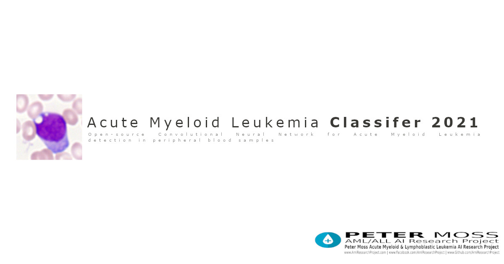

# Asociación de Investigacion en Inteligencia Artificial Para la Leucemia Peter Moss
## Acute Myeloid Leukemia Classifier 2021
### Ubuntu Installation



&nbsp;

# Table Of Contents

- [Introduction](#introduction)
- [Prerequisites](#prerequisites)
- [Installation](#installation)
	- [Clone The Repository](#clone-the-repository)
		- [Developer Forks](#developer-forks)
	- [Setup File](#setup-file)
- [Continue](#continue)
- [Contributing](#contributing)
  - [Contributors](#contributors)
- [Versioning](#versioning)
- [License](#license)
- [Bugs/Issues](#bugs-issues)

# Introduction

# Prerequisites

# Installation

## Clone the repository

Clone the [Acute Myeloid Leukemia Classifier 2021](https://github.com/AMLResearchProject/Acute-Myeloid-Leukemia-Classifier-2021 " Acute Myeloid Leukemia Classifier 2021") repository from the [Peter Moss Acute Myeloid & Lymphoblastic Leukemia AI Research Project](https://github.com/AMLResearchProject "Asociación de Investigacion en Inteligencia Artificial Para la Leucemia Peter Moss") Github Organization.

To clone the repository and install the OneAPI Acute Lymphoblastic Leukemia Classifier Classifier, make sure you have Git installed. Now navigate to the a directory on your device using commandline, and then use the following command.

```
 git clone https://github.com/AMLResearchProject/Acute-Myeloid-Leukemia-Classifier-2021.git
```

Once you have used the command above you will see a directory called **Acute-Myeloid-Leukemia-Classifier-2021** in your home directory.

```
 ls
```

Using the ls command in your home directory should show you the following.

```
 Acute-Myeloid-Leukemia-Classifier-2021
```

Navigate to the **Acute-Myeloid-Leukemia-Classifier-2021** directory, this is your project root directory for this tutorial.

### Developer Forks

Developers from the Github community that would like to contribute to the development of this project should first create a fork, and clone that repository. For detailed information please view the [CONTRIBUTING](../../CONTRIBUTING.md "CONTRIBUTING") guide. You should pull the latest code from the development branch.

```
 git clone -b "1.0.0" https://github.com/AMLResearchProject/Acute-Myeloid-Leukemia-Classifier-2021.git
```

The **-b "1.0.0"** parameter ensures you get the code from the latest master branch. Before using the below command please check our latest master branch in the button at the top of the project README.

## Setup File

&nbsp;

# Continue
Now you can continue with the Acute Myeloid Leukemia Classifier 2021 [getting started guide](../getting-started.md)

&nbsp;

# Contributing

The Peter Moss Acute Myeloid & Lymphoblastic Leukemia AI Research project encourages and youlcomes code contributions, bug fixes and enhancements from the Github.

Please read the [CONTRIBUTING](../../CONTRIBUTING.md "CONTRIBUTING") document for a full guide to forking our repositories and submitting your pull requests. You will also find information about our code of conduct on this page.

## Contributors

- [Adam Milton-Barker](https://www.leukemiaairesearch.com/association/volunteers/adam-milton-barker "Adam Milton-Barker") - [Asociación de Investigacion en Inteligencia Artificial Para la Leucemia Peter Moss](https://www.leukemiaresearchassociation.ai "Asociación de Investigacion en Inteligencia Artificial Para la Leucemia Peter Moss") President/Founder & Lead Developer, Sabadell, Spain

&nbsp;

# Versioning

You use SemVer for versioning. For the versions available, see [Releases](../../releases "Releases").

&nbsp;

# License

This project is licensed under the **MIT License** - see the [LICENSE](../../LICENSE "LICENSE") file for details.

&nbsp;

# Bugs/Issues

You use the [repo issues](../../issues "repo issues") to track bugs and general requests related to using this project. See [CONTRIBUTING](../../CONTRIBUTING.md "CONTRIBUTING") for more info on how to submit bugs, feature requests and proposals.